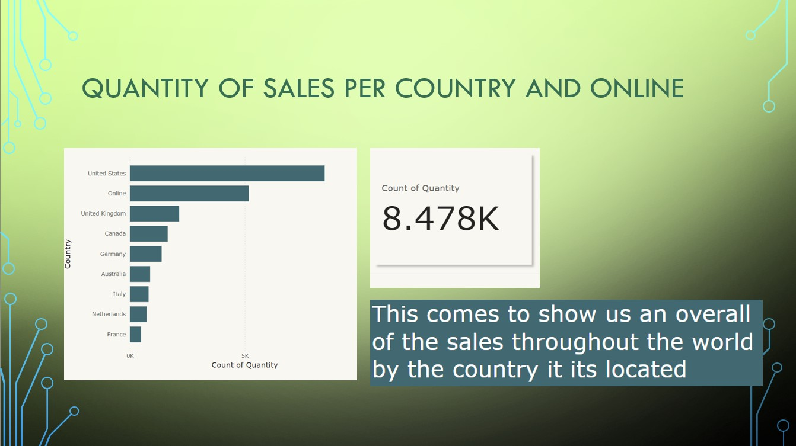
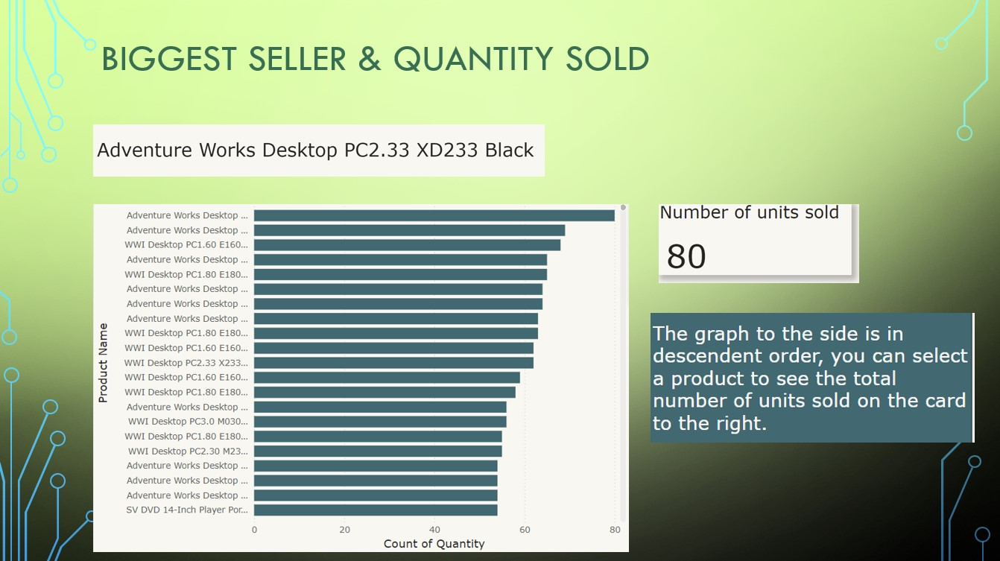
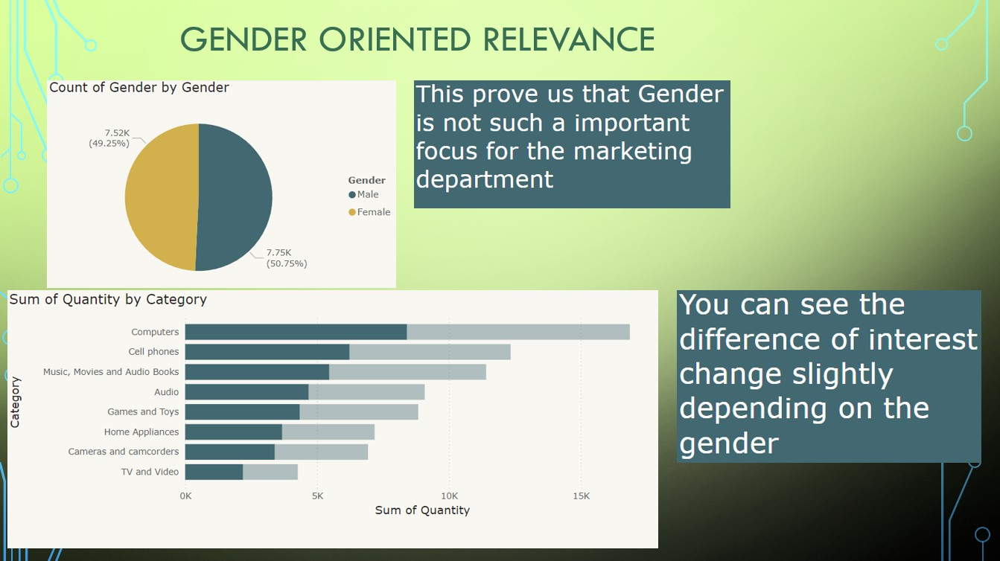

<h1> Global Electronics Dashboard </h1>
 
<h4>The data was downloaded from the Maven Analytics website under the data playground section.
  
The data consists of 5 different tables with 1 Excel dictionary. </h4>
<ul>
<li> Customers.csv </li>
<li> Exchange_Rates.csv </li>
<li> Products.csv </li>
<li> Sales.csv </li>
<li> Stores.csv </li>
 </ul>
 <h2> Why Did I choose this dataset: </h2>

 I believe that with a dataset this big I would have to put into practice everything I learned about data cleaning, how to relate tables to each other, and how to construct interesting queries under MySQL.
  
With so much data available I would come up with very interesting insights.

<h2>Data Cleaning</h2>

 <h3>Power BI</h3>
When transforming the date columns I had to explicitly change the format from American to UK otherwise I would be getting errors.  
Dealing with price columns I had to remove dollar signs before I could change the column data type to float.  
A few tables came with a bad format where the first row was the title for the columns so I used the Power BI option to set the first row as the column header. 
Different countries have different formats for their zip codes so I wouldn’t use this column in any visualization so I deleted it.

 <h3>MySQL</h3>

After importing the data into a Schema in MySQL Workbench I took notice that column headers had space in their names and this would cause many problems so I went on and replaced every space with an underscore.

<h2>Key Questions</h2>

<ol>
<li>Which country is the leading in sales? 
<li>What is the top seller?
<li>How many items in total were sold?
<li>Is gender a relevant parameter for sales?
<li>How to query every piece of information from a specific product?
</ol>

<h2> Dashboard Summary</h2>
<h3> Correlation Country/Sales</h3>

<i>The United States is the leading country in sales</i>

<h3> Top Seller Product</h3>

<i>Approximately 61 million sales in total</i>

<h3> Gender Relevance</h3>

<i>Gender is not relevant for sales</i>

 
 
<h2>Counclusion</h2>
<ol>
 <li>United States</li>
 <li>Adventure Works Desktop PC2.30 XD233 Black</li>
 <li>Approximately 61 Million</li>
 <li>No, with a difference of less than 1%</li>
 <li>Using the clause WHERE when querying you can filter only the product you desire</li>
</ol>
